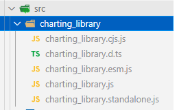

# Flutter Charting Library Example

This is an example on how to add charting_library to your flutter application with JS api.
The repo contains 2 projects, flutter project and js project.
Before starting, read prerequisite.

# Prerequisite

- Flutter 2.0 or newer
- Access to charting_library v19.x (or newer)
- (IMPORTANT) Knowledge on how to use charting_library on web

# Step to build

## Bundling charting_library

First you need to bundle charting_library as a single page web.
You can use your own bundler/way. But if you need quick you can use method this example use:

1. Grab these files and put it on `src/charting_library`



2. Run build script `npm run build`
3. Bundled files should be in dist folder

## Add charting_library to flutter

This example is using `flutter_inappwebview` for WebView and localhost, to serve webpage directly from assets folder. You can use other WebView packages/serve via server, if you wish.
For this example follow this method:

1. Grab the dist files from step before
2. Create folder `assets/tvchart`, and paste those files.
3. Create folder `assets/tvchart/public`, and paste all files charting_library needed (the one needed from library_path). This is assets folder should like right now.


4. Add folder to your `pubspec.yaml` assets list, you need to specify all subfolder as well check example `pubspec.yaml`.
5. Run flutter app on your devices.


## (Optional) Adding new types/class

If you needed types/class that doesn't exist yet on `tvchart_types.dart` you can check the typedef (.d.ts files) on charting_library and try to add an equivalent class to `tvchart_types.dart`, and then add `toJson` and `fromJson` function (see other class as example).
After that run build_runner to generate new/updated `JsonSerializable` annotated class. You can run it using vscode tasks `Run build_runner` or with terminal command
```
flutter pub run build_runner build --delete-conflicting-outputs
```

The only limitation here is any properties with `function` values is not supported, as `function` is not a JSON valid value.

## Some points that you should know

- Since this example is using localhost http to serve files, you need to allow localhost on `ios/Runner/Info.plist` with `NSAllowsLocalNetworking` (iOS 10+). If you serve the webpage from server with https this won't be needed. By default iOS block all http pages.

```
<key>NSAppTransportSecurity</key>
<dict>
    <key>NSAllowsLocalNetworking</key>
    <true/>
</dict>
```

# FAQ

**Q:** I don't have access to charting_library, help!

**A:** Not my problem.
##

**Q:** charting_library files is missing here.

**A:** It's not included, you need to add yours to this project.
##

**Q:** Do you have any apk build to test/check?

**A:** I will not provide any kind of build for this example.
##

**Q:** I want to ask question.

**A:** Open new issue.
##

**Q:** I have error in charting_library side, symbol not exist, etc.

**A:** I won't answer any question that is not related to integration chart to flutter, if you don't know how to use charting_library ask on their discord/github, not here.
##

**Q:** It doesn't work because this example use old version of charting_library.

**A:** Open new issue. I'll try to update the example with latest available lib version.
##

**Q:** Does this work on Android, iOS, and Web?

**A:** Yes, Yes, No atm.
##

**Q:** Does this work on other WebView packages?

**A:** As long the packages support 2 way communication between dart and JS, Yes. Otherwise, No.
##

**Q:** Does the chart react to theme changes?

**A:** Yes if used under `MaterialApp`, I haven't test it under `CupertinoApp` yet.
##

**Q:** There are some types/class I needed that not exist on `tvchart_types.dart` yet. How do I add them?

**A:** You can check the charting_library typedef, and add stuff you needed. Check `(Optional) Adding new types/class`.
##

**Q:** How do I add properties with `function` value?

**A:** The communication between dart and JS relies on JSON parse/decode, since function is not valid JSON value, you need to add any function value on JS side, maybe by passing message on json you could add predefined function value on JS side. If you know a better way to do this, let me know.
##

# Screenshot

## Android

Android 11


## iOS

iOS 14.4.2 with `MaterialApp`


